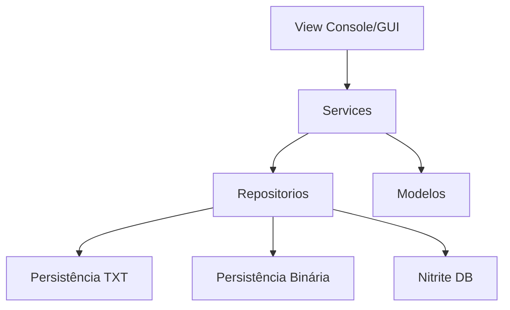

Claro, Alex — aqui está **um README.md profissional, completo e pronto para colocar no GitHub**, seguindo boas práticas e linguagem corporativa.

---

# 🚀 Sistema *Missões Espaciais*

**Gerenciamento de Missões · Astronautas · Naves · Persistência (TXT / NitriteDB) · Console & GUI Java**

Este projeto implementa um sistema completo para gerenciar missões espaciais, astronautas e naves, integrando camadas de **modelo, serviço, persistência e interface (Console / GUI Swing)**.
Foi desenvolvido para fins acadêmicos, seguindo boas práticas de arquitetura, modularização e experiência de usuário.

---

## 📌 Funcionalidades Principais

### ✔ Gerenciamento de Missões

* Cadastrar missão
* Listar missões
* Pesquisar missão
* Excluir missão

### ✔ Gerenciamento de Astronautas

* Cadastrar astronauta
* Listar astronautas
* Buscar astronauta
* Remover astronauta

### ✔ Gerenciamento de Naves

* Cadastrar nave
* Listar naves
* Buscar nave
* Remover nave

### ✔ Camadas de Persistência

* **TXT serializado**
* **Armazenamento binário**
* **Banco embutido Nitrite DB**

O projeto permite trocar o repositório facilmente apenas alterando a instância usada na camada de serviço.

---

## 🏛 Arquitetura do Projeto



---

## 📂 Estrutura do Projeto

```
src/
 └── main/
      ├── java/
      │    └── br/com/lunarsystems/missoes/
      │         ├── model/
      │         ├── service/
      │         ├── persistence/
      │         ├── view/
      │         └── enums/
      └── resources/
pom.xml
README.md
```

---

# ▶ Como Executar o Projeto

## 1️⃣ **Compilar o projeto**

```bash
mvn clean package
```

## 2️⃣ **Executar versão Console**

```bash
java -jar target/missoes-1.0.0.jar
```

## 3️⃣ **Executar versão GUI**

(Se o *pom.xml* já estiver apontando para GuiApp como main)

```bash
java -cp target/missoes-1.0.0.jar br.com.lunarsystems.missoes.view.GuiApp
```

Ou, se estiver usando shade/exec no pom:

```bash
java -jar target/missoes-1.0.0.jar
```

---

# 🛠 Requisitos

* **Java 17+**
* **Maven 3+**
* Sistema operacional Windows / Linux / Mac

---

# 🌐 Publicar no GitHub

### 1️⃣ Configurar repositório remoto (caso já exista, ignore)

```bash
git remote add origin https://github.com/alexeduardo01/missoes.git
```

### 2️⃣ Adicionar mudanças

```bash
git add .
```

### 3️⃣ Commit

```bash
git commit -m "Primeiro commit do projeto Missoes"
```

### 4️⃣ Enviar para o GitHub

```bash
git push origin main
```

Ou, caso use branch master:

```bash
git push origin master
```

---

# 📜 Licença

Projeto acadêmico — livre para estudo e evolução.

---

# 🤝 Autor

**Alex Eduardo Paweukievicz**
Estudante de TI · Profissional de Marketing Digital
GitHub: [https://github.com/alexeduardo01](https://github.com/alexeduardo01)

Só pedir! 🚀
